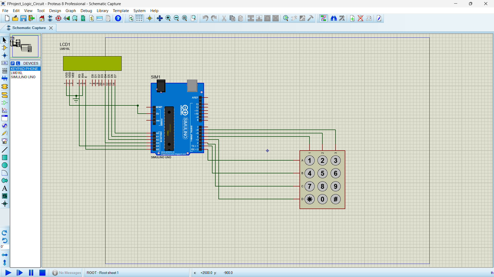

# Digital Lock System with Arduino

## Overview
This project involves programming a digital lock system using Arduino. The user can enter a password to unlock the system and change the password if desired. The system consists of three main components: a keypad, an Arduino board, and an LCD display.

## Components
1. **Keypad**: The input device where the user enters the password. We use a phone keypad for this purpose.
2. **Arduino**: The processing unit that handles the input from the keypad, processes it, and sends the output to the LCD.
3. **LCD Display**: The output device that shows the status of the lock, whether the password is correct, and other relevant messages.

---

## Setup

### 1. **Installing the Keypad Library in Arduino**
To run this project, the **Keypad library** must be installed in the Arduino IDE. Follow these steps:

1. Open the Arduino IDE.
2. Go to **Tools** > **Manage Libraries**.
3. In the search bar, type **Keypad**.
4. Find the library named **Keypad by Mark Stanley, Alexander Brevig** and click **Install**.
5. Once installed, the library is ready to use.

**Note**: The Keypad library is essential for this project. Without it, the code will not compile. Make sure to install it before proceeding.

---

### 2. **Compiling the Code and Extracting the HEX File**
After installing the library, upload the code to the Arduino IDE and compile it. To extract the HEX file, follow these steps:

1. Open the project code in the Arduino IDE.
2. Go to **Sketch** > **Export Compiled Binary**.
3. The HEX file will be saved in the project folder, usually in a folder named **build** or in the same directory as the `.ino` file.

---

### 3. **Adding the HEX File to Proteus**
To simulate the project in Proteus, you need to add the HEX file to the Arduino microcontroller in Proteus. Follow these steps:

1. Open Proteus and design your circuit (including Arduino, keypad, LCD, and other components).
2. Double-click on the Arduino microcontroller in Proteus to open its settings.
3. In the **Program File** section, browse and select the HEX file you exported from the Arduino IDE.
4. Confirm the settings and start the simulation.

---

## Functionality

1. **Initial Setup**:
   - The default password is set to `0000`.
   - The LCD displays a prompt for the user to enter the password.

2. **Password Entry**:
   - The program enters an infinite loop, constantly checking for keypad input.
   - If a number is pressed, it is pushed onto a stack.
   - If the `*` key is pressed, the last entered number is removed from the stack.
   - If the `#` key is pressed, the entered password is compared with the stored password.

3. **Password Verification**:
   - If the entered password matches the stored password, the LCD displays "Access Granted" and offers options to change the password or exit.
   - If the password does not match, the LCD displays "Incorrect Password" and prompts the user to try again.

4. **Changing the Password**:
   - If the user selects the option to change the password, they are prompted to enter a new password twice for verification.
   - If the new passwords match, the stored password is updated, and the LCD displays "Password Changed".
   - If the new passwords do not match, the LCD displays "Mismatch" and prompts the user to try again.

---

## Code Structure

- **Default Password**: Stored in an array.
- **Stack**: Used to store user input.
- **LCD Display**: Uses the LiquidCrystal library to show messages.

---

## Project Demonstration

### Video Demonstration
Here is a video demonstrating the functionality of the Digital Lock System:

https://github.com/your-username/Digital-Lock-System/blob/main/video.mp4

### Image
Below is an image of the project setup:

---

## How to Use
1. Clone this repository to your local machine.
2. Open the Arduino code in the `Arduino/` folder and upload it to your Arduino board.
3. Open the Proteus simulation file in the `Proteus/` folder and load the HEX file into the Arduino microcontroller.
4. Run the simulation and test the system.

---
